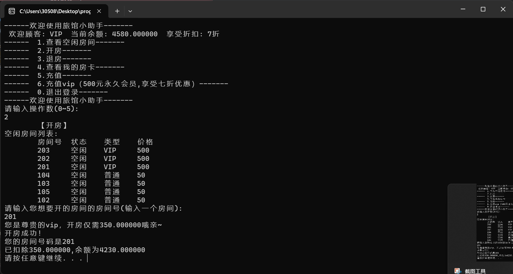

# 目录

- [项目介绍](# 项目介绍)
- [项目使用的东西](# 项目使用的东西)
- [完成的功能](# 完成的功能)

> ## 项目介绍

---

​		本项目为**旅店管理系统**，可以实现旅店房间的增删查与用户的基本交互。

​		是我个人入门链表之后的第一个项目，因此在这方面的代码相当不成熟。也是我第一次写这么长的代码，有许多冗余的成分。并且很多代码都是在后面觉得可以优化，临时改变了风格，尽管打了许多注释并且分好了区块，可读性仍然不高。

​		但是基本让我理清楚了交互菜单的逻辑，以及熟悉了链表的基本使用。用于个人入门练习而言，具有较大意义。

​		有许多可以优化的地方，例如可以把函数分类改成库设置到别的文件，这样看起来会简洁许多。也可以把部分重复的代码改成函数直接调用（这个在后面写的时候突然意识到才开始改）。

---

> ## 项目使用的东西

**语言：**C语言

**C语言的基本特性：**函数，指针，结构体, 动态内存分配， 文件读写。

**库:**<stdlib.h>, <stdio.h>, <string.h>

**其他：**指针和结构体的进阶组合：链表

---

> ## 完成的功能

1.实现用户的增删改查

​		可以通过注册账号实现增加账号，并且登录管理员账号（注册管理员账号需要使用密码：123456）时可以直接增加账号和注销其他账号或者更改账号的身份，查找账号功能没有在交互中体现，但是在链表相关函数中存在，并且在后续确定链表节点位置时发挥了重要作用。

​		

2.实现酒店房间的增删改查

​		通过分流管理员账号和普通账号的交互页面，使得只有管理员账号才拥有增删账号和房间的功能，同时，顾客可以定一个房间，余额会被相应扣除，同时房间链表中房间的状态还有账号的房间状态也会被更改。

​		同时，如果钱不够或者房间被占用又或者已经有房间会有相应的失败反馈。

​		实现了vip和普通账户开房的不同折扣力度

​		用户可以通过查看空余房间选项查看所有空余房间的房间号，类型和价格。

3.实现了数据的持久化

​		通过文件的读写功能，将文件用txt保存至本地，并在每次开启程序时读取。（具体位置位于源文件的根目录）

4.对原本的界面显示进行了优化

​		原本是会往下一直输出的代码块，在每次菜单操作开始前进行了清屏，做到了视觉上菜单位置不发生变化的效果（使用了system("cls")），同时防止出现闪屏现象出现，多处使用system("pause")

5.登录状态的实现

​		使用全局变量在进入登录时设置为真，放在while循环中用作死循环，退出登录时将该变量再修改为假，退出死循环，达到退出登录返回主菜单的效果。此外，在最开始的主菜单也使用了类似的效果，只有使用0.退出程序来退出才是正常的退出。其他选项都会进入死循环，不会结束运行程序。

​		

---

